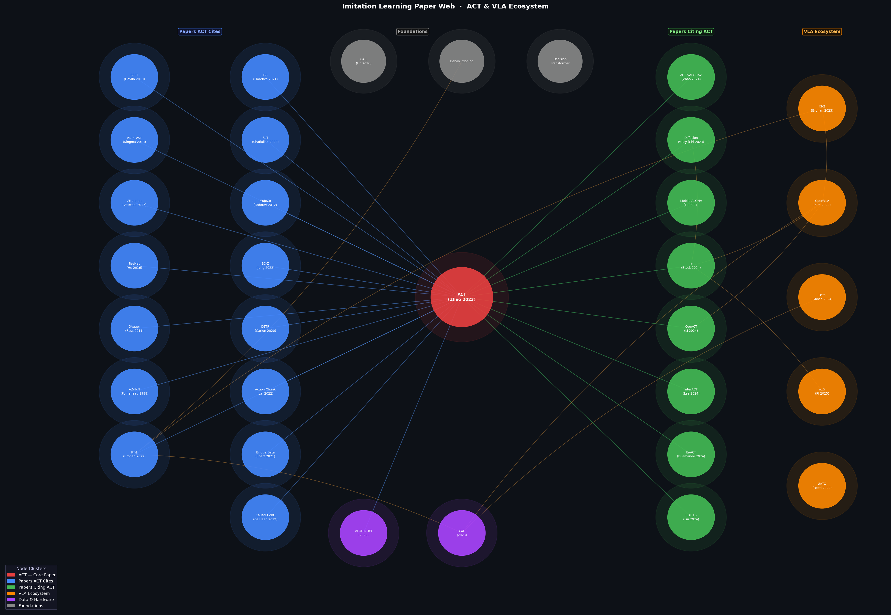

# Imitation Learning for Robot Manipulation
## A Practitioner's Textbook
### Centered on ACT, VLA Models, and the Modern Robot Learning Stack

---

> **About this textbook.** This is a living technical reference for engineers and researchers building imitation learning systems for robotic manipulation. It is structured around the paper web anchored by the ACT model ([Zhao et al., 2023](https://arxiv.org/abs/2304.13705)) and the emerging Vision-Language-Action (VLA) ecosystem. Every chapter prioritizes equations with explanation, PyTorch pseudocode, and concrete benchmark numbers over abstract theory.

---

## Table of Contents

### Foundations

| Chapter | Title | Key Topics |
|---------|-------|------------|
| [Ch. 0](./ch00_foundations.pplx.md) | **Foundations of Robot Learning** | MDP/POMDP framework, action/observation representations, compounding error theorem, terminology glossary |
| [Ch. 1](./ch01_literature_review.pplx.md) | **Literature Review** | ALVINN → DAgger → BeT → RT-1 → ACT → Diffusion Policy → RT-2 → OpenVLA → π₀, full method comparison table |

### Core Models

| Chapter | Title | Key Topics |
|---------|-------|------------|
| [Ch. 2](./ch02_models.pplx.md) | **Models: ACT, VLAs, and Related Architectures** | ACT full architecture (CVAE + Transformer), Diffusion Policy, RT-1, RT-2, OpenVLA, π₀, Octo — equations, PyTorch code, comparison table |

### Data, Training, and Extensions

| Chapter | Title | Key Topics |
|---------|-------|------------|
| [Ch. 3](./ch03_data_sources.pplx.md) | **Data Sources and Collection Approaches** | ALOHA teleoperation, OXE dataset, DROID, Bridge, simulation data, RLDS format, PyTorch dataset class, scaling laws |
| [Ch. 4](./ch04_training.pplx.md) | **How Models Are Trained** | BC training loop, ACT/CVAE training, Diffusion Policy DDPM/DDIM, VLA fine-tuning (LoRA, full), co-training, infrastructure, pitfalls |
| [Ch. 5](./ch05_extensions_rl.pplx.md) | **Extensions: RL, Hierarchical Policies, and Beyond** | GAIL/IRL, residual RL, GRPO/WMPO, hierarchical IL, multi-task, CoT-VLA, safety (SAFE, CBF), DAgger variants |

### Infrastructure and Deployment

| Chapter | Title | Key Topics |
|---------|-------|------------|
| [Ch. 6](./ch06_compute.pplx.md) | **Compute Requirements** | Hardware tiers (RTX 2080 Ti → TPU pod), quantization, LoRA, MoLe-VLA, distillation, real-time constraints, full compute table |
| [Ch. 7](./ch07_simulation.pplx.md) | **The Scope of Simulations** | MuJoCo, IsaacLab, RLBench, SAPIEN, Genesis, sim-to-real transfer, benchmarks (LIBERO, MetaWorld, SIMPLER, RLBench) |
| [Ch. 8](./ch08_evaluation.pplx.md) | **Evaluation and Benchmarking** | Success metrics, Wilson CI, ALOHA/BridgeV2/OpenVLA/RLBench protocols, ablation design, common pitfalls |
| [Ch. 9](./ch09_deployment.pplx.md) | **Deployment and Real-World Considerations** | ROS2 inference node, latency budgets, failure modes, data flywheel, cross-embodiment, production checklist |

---

## The ACT & VLA Paper Web

The diagram below maps the citation relationships between the core ACT paper, the works it builds upon, papers that cite it, and the parallel VLA ecosystem.

### Node Key

| Color | Cluster | Description |
|-------|---------|-------------|
| 🔴 Red | **ACT (Core)** | [Zhao et al., 2023](https://arxiv.org/abs/2304.13705) — Learning Fine-Grained Bimanual Manipulation with Low-Cost Hardware |
| 🔵 Blue | **Papers ACT Cites** | Foundational works: Attention Is All You Need, BERT, VAE/CVAE, ResNet, DAgger, RT-1, IBC, BeT, MuJoCo, BC-Z |
| 🟢 Green | **Papers Citing ACT** | Direct descendants: ACT2, Mobile ALOHA, Diffusion Policy, π₀, CogACT, InterACT, Bi-ACT, RDT-1B |
| 🟠 Orange | **VLA Ecosystem** | RT-2, OpenVLA, Octo, CoT-VLA, GATO, π₀.5 |
| 🟣 Purple | **Data & Hardware** | Open X-Embodiment, ALOHA hardware |
| ⬜ Gray | **Foundations** | Behavior Cloning, GAIL, Decision Transformer |

---

## Key Paper Index

### ACT and Direct Extensions

| Paper | Year | Venue | Link |
|-------|------|-------|------|
| Learning Fine-Grained Bimanual Manipulation (ACT) | 2023 | RSS | [arXiv:2304.13705](https://arxiv.org/abs/2304.13705) |
| ALOHA Unleashed / ACT2 | 2024 | CoRL | [arXiv:2410.13126](https://arxiv.org/abs/2410.13126) |
| Mobile ALOHA | 2024 | CoRL | [arXiv:2401.02117](https://arxiv.org/abs/2401.02117) |
| InterACT | 2024 | arXiv | [arXiv:2409.07914](https://arxiv.org/abs/2409.07914) |
| Bi-ACT | 2024 | arXiv | [arXiv:2401.17698](https://arxiv.org/abs/2401.17698) |
| Bidirectional Decoding | 2024 | arXiv | [arXiv:2408.17355](https://arxiv.org/abs/2408.17355) |
| RDT-1B | 2024 | arXiv | [arXiv:2410.07864](https://arxiv.org/abs/2410.07864) |

### VLA Models

| Paper | Year | Venue | Link |
|-------|------|-------|------|
| RT-1: Robotics Transformer | 2022 | ICRA | [arXiv:2212.06817](https://arxiv.org/abs/2212.06817) |
| RT-2: VLA Models Transfer Web Knowledge | 2023 | CoRL | [arXiv:2307.15818](https://arxiv.org/abs/2307.15818) |
| GATO: A Generalist Agent | 2022 | TMLR | [arXiv:2205.06175](https://arxiv.org/abs/2205.06175) |
| Octo: Open-Source Generalist Policy | 2024 | RSS | [arXiv:2405.12213](https://arxiv.org/abs/2405.12213) |
| OpenVLA | 2024 | CoRL | [arXiv:2406.09246](https://arxiv.org/abs/2406.09246) |
| π₀: Flow Model for General Robot Control | 2024 | arXiv | [arXiv:2410.24164](https://arxiv.org/abs/2410.24164) |
| π₀.5: Open-World Generalization | 2025 | arXiv | [arXiv:2504.16054](https://arxiv.org/abs/2504.16054) |
| CoT-VLA | 2025 | CVPR | [IEEE](https://ieeexplore.ieee.org/document/11093669/) |

### Foundational Methods

| Paper | Year | Venue | Link |
|-------|------|-------|------|
| DAgger (Ross et al.) | 2011 | AISTATS | [CMU PDF](https://www.cs.cmu.edu/~sross1/publications/Ross-AIStats11-NoRegret.pdf) |
| GAIL (Ho & Ermon) | 2016 | NeurIPS | [arXiv:1606.03476](https://arxiv.org/abs/1606.03476) |
| IBC: Implicit Behavioral Cloning | 2021 | CoRL | [arXiv:2109.00137](https://arxiv.org/abs/2109.00137) |
| BeT: Behavior Transformers | 2022 | NeurIPS | [NeurIPS PDF](https://proceedings.neurips.cc/paper_files/paper/2022/file/90d17e882adbdda42349db6f50123817-Paper-Conference.pdf) |
| Diffusion Policy | 2023 | RSS/IJRR | [arXiv:2303.04137](https://arxiv.org/abs/2303.04137) |
| BC-Z | 2022 | CoRL | — |

### Data and Benchmarks

| Paper | Year | Link |
|-------|------|-------|
| Open X-Embodiment (OXE) | 2023 | [arXiv:2310.08864](https://arxiv.org/abs/2310.08864) |
| DROID Dataset | 2024 | — |
| Bridge Data | 2021 | [arXiv:2109.13396](https://arxiv.org/abs/2109.13396) |
| LIBERO | 2023 | — |

---

## How to Use This Textbook

**If you are new to robot learning:** Start with [Chapter 0](./ch00_foundations.pplx.md) for the formal framework, then [Chapter 1](./ch01_literature_review.pplx.md) for the historical sweep.

**If you want to implement ACT:** Go directly to [Chapter 2](./ch02_models.pplx.md) (architecture + PyTorch code), [Chapter 3](./ch03_data_sources.pplx.md) (dataset class), and [Chapter 4](./ch04_training.pplx.md) (training loop).

**If you want to use or fine-tune a VLA:** Read [Chapter 2](./ch02_models.pplx.md) (VLA architectures), [Chapter 4](./ch04_training.pplx.md) (LoRA fine-tuning), and [Chapter 6](./ch06_compute.pplx.md) (hardware requirements).

**If you are deploying on a real robot:** [Chapter 8](./ch08_evaluation.pplx.md) for evaluation setup, [Chapter 9](./ch09_deployment.pplx.md) for ROS2 integration, latency budgets, and failure modes.

**If you are extending with RL:** [Chapter 5](./ch05_extensions_rl.pplx.md) covers the full spectrum from GAIL to GRPO-based VLA fine-tuning.

---

## Notation Reference

| Symbol | Meaning |
|--------|---------|
| $`s_t`$ | State at timestep $`t`$ |
| $`o_t`$ | Observation at timestep $`t`$ (may differ from state under partial observability) |
| $`a_t`$ | Action at timestep $`t`$ |
| $`\pi`$ | Policy $`\pi: \mathcal{S} \rightarrow \mathcal{A}`$ |
| $`\pi^*`$ | Expert / oracle policy |
| $`\mathcal{D}`$ | Demonstration dataset |
| $`k`$ | Action chunk size (default 100 in ACT) |
| $`z`$ | Latent style variable in CVAE (32D in ACT) |
| $`\beta`$ | KL regularization weight in CVAE (10 in ACT) |
| $`\bar{\alpha}_t`$ | DDPM cumulative noise schedule |
| $`v_\theta`$ | Flow matching velocity field |
| $`T`$ | Episode length (horizon) |
| $`\epsilon`$ | Per-step policy error |

---

*Last updated: April 2026. This textbook is structured as a living document — chapters will be extended as the field evolves.*
